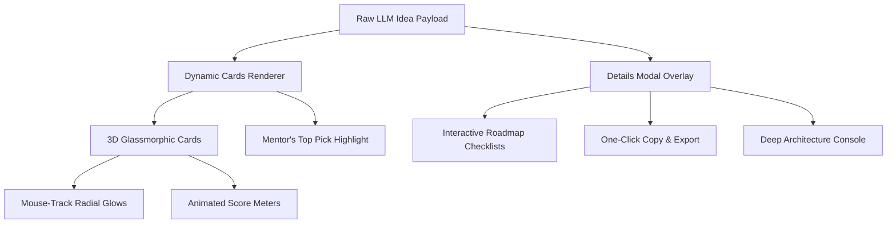

# HackForge AI – Premium Card & Modal UI/UX System Specification

This document details the architecture, design tokens, micro-interactions, and visual guidelines for the **Hackathon Project Cards** and **Expanded Details Modal** inside HackForge AI. These components form the core UX value of the application, translating raw AI recommendation responses into actionable developer roadmap consoles.

---

## 🎨 DESIGN SYSTEM & THEMES

All cards and modal popups inherit design values from the global CSS console variables:
- **BG Hue**: `hsl(225, 25%, 6%)` (Deep Space Dark)
- **Accent Color**: `hsl(175, 80%, 45%)` (Cyber Cyan / Teal)
- **Primary Color**: `hsl(250, 85%, 58%)` (Neon Indigo)
- **Accent Glow**: `hsla(175, 80%, 45%, 0.25)`

### 1. The Idea Recommendation Cards (`.idea-card`)
A three-column grid layout where each card represents a technical paradigm:
1. **AI-Centric Solution** — Focuses on LLM, NLP, or computer vision integrations.
2. **Web/App Platform** — Focuses on user-facing full-stack frameworks and integrations.
3. **Automation & System Tool** — Focuses on scripts, cron workers, databases, or local workflows.

### 2. The Expanded Details Modal (`.modal-card`)
A heavy-duty overlay container that slides up, utilizing deep blur (`backdrop-filter`) and containing:
- Full interactive roadmap check-off lists.
- Detailed judge scorecard metrics.
- One-click copy/share tools for hackathon pitches.

---

## 🛠️ UI/UX IMPROVEMENT PARADIGMS

The upcoming implementation focuses on upgrading these components from basic boxes to premium, dashboard-level assets.

### 1. Card Interface upgrades
- **Dynamic Mouse-Track Hover Glow**: Implement radial gradient backgrounds inside cards that shift coordinates based on the user's cursor position (`mousemove` event handler).
- **Rotating Gradient Rims on Hover**: Extend the rotating rim pattern to all cards on hover, with the **Mentor Pick** card having a permanent, extra-thick rotating accent glow.
- **Responsive Stagger Animations**: Stagger card animation loads sequentially using CSS custom property `--animation-delay` variables for organic page entries.
- **Premium Typographic hierarchy**: Upgrade fonts to `Outfit` and `Space Grotesk` for titles, utilizing wider letter-spacing.

### 2. Expanded Modal console upgrades
- **Interactive Checklists**: Transform the static roadmap `<ol>` into interactive task trackers. Users can check off phases (e.g., "Step 1: Parse data Tables with Pandas") which dynamically updates a total completion progress bar.
- **Copy & Share Tools**: A floating clipboard action button that copies the complete markdown layout of the project architecture and roadmap checklist.
- **"Deep-Forge" Architecture Blueprint**: Introduce a secondary LLM trigger button inside the modal to generate file-structure blueprints, database schema examples, and initialization scripts for that specific project.
- **Adaptive Score Indicators**: Score meters will animate sequentially from 0% width upon modal mount, accompanied by counting numeric indicators.

---

## ⚙️ TECHNICAL COMPONENT IMPLEMENTATION SCHEMA

### CSS Structure
All modal card selectors reside within the layout and overlay sections in `style.css`:
- `.ideas-layout-grid`: Coordinates the 3-column placement.
- `.idea-card`: Manages background gradient base layers and borders.
- `.idea-card.best-card`: Styles the Mentor Pick.
- `.modal-overlay`: Absolute full-viewport backdrop.
- `.modal-card`: Responsive details pane.

### JavaScript Bindings
Event handlers bind inside `script.js`:
- `openDetailsModal(index)`: Mounts payload, resets and triggers animations.
- `closeDetailsModal()`: Handles teardown, scroll locks, and resets checkboxes.
- Scroll tracker: Closes/adjusts layers on esc key or overlay bounding click.
